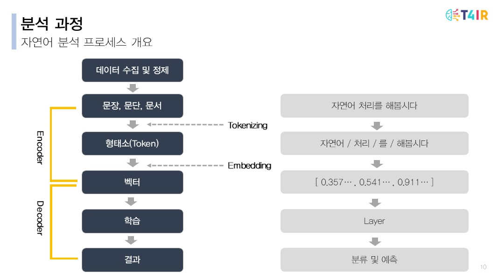
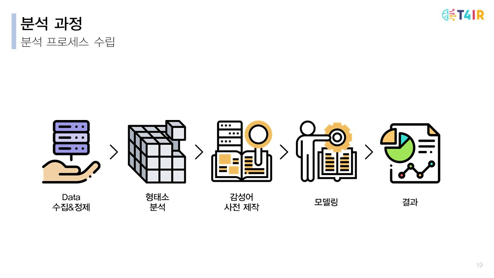

# **웹 반응 데이터를 활용한 주 52시간 근무제 영향평가 분석**

## 1. 프로젝트 소개

> 해당 프로젝트는 머신러닝 분석 1000시간 교육과정의 학습내용을 종합하여 최종 결과물을 구현하는 팀 프로젝트입니다. Made by. 고영빈,박소희, 송이레, 이상아

* **기획 의도**
  1. 수많은 리뷰사이트 중 일상생활에 직접 영향을 주는 정책에 대한 리뷰사이트가 없다.
  2. 현재 정책에 대한 실효성 평가는 한정적이다.
     * 
  3. 정책에 대한 댓글을 모아 분석한다면 정책의 실효성을 평가해 볼 수 있을까?
* **주제 정의**
  * 주 52시간 근무제 - 웹 댓글 데이터 분석을 통한 체감도 조사
  * 댓글 데이터 분석을 위한 자연어 처리

## 2. 분석과정

> NLP 기본 흐름
>
> 

### 1. 분석 프로세스

​	

## 3. 실효성 평가

## 4. 결론 

## 5. 발전방향 및 첨부자료

