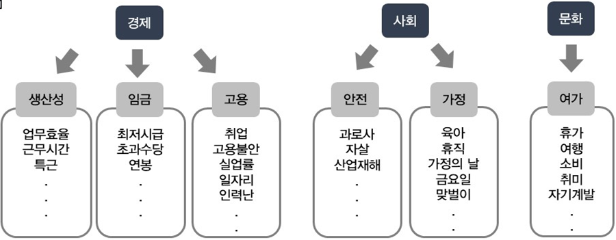

# **웹 반응 데이터를 활용한 주 52시간 근무제 영향평가 분석**

## 1. 프로젝트 소개

> 본 프로젝트는 머신러닝 분석 1000시간 교육과정의 학습내용을 종합하여 최종 결과물을 구현하는 팀 프로젝트입니다. Made by. 고영빈,박소희, 송이레, 이상아

* **기획 의도**
  1. 수많은 리뷰사이트 중 일상생활에 직접 영향을 주는 정책에 대한 리뷰사이트가 없다.
  2. 현재 정책에 대한 실효성 평가는 한정적이다.
     * ex) 
  3. 정책에 대한 댓글을 모아 분석한다면 정책의 실효성을 평가해 볼 수 있을까?
* **주제 정의**
  * 댓글 데이터 분석을 위한 자연어 처리
  * 주 52시간 근무제 - 웹 댓글 데이터 분석을 통한 체감도 조사 [`감성분석`  >>  `실효성평가`]

## 2. 분석과정

### 2-1. NLP Flow 소개

### 2-2. 데이터 수집

* 데이터 스키마

  |     컬럼명     |      속성       |
  | :------------: | :-------------: |
  |      site      |    사이트명     |
  |     title      |    기사 제목    |
  |  article_time  |   기사 작성일   |
  |     press      |     언론사      |
  | total_comments | 기사 총 댓글 수 |
  |    nickname    |   댓글 닉네임   |
  |      date      |   댓글 작성일   |
  |    contents    |    댓글 내용    |
  |     recomm     |  댓글 추천 수   |
  |    unrecomm    | 댓글 비추천 수  |

### 2-3. 형태소 분석 & 긍/부정 사전 제작

#### 1. 형태소 분석

> 형태소 분석 목적
>
> - Web에서 사용하는 단어들을 분석 가능한 형태로 얻기 위해
>
> 형태소 분석기 선택
>
> * 형태소 분석기 종류 mecab, okt, kkma, hanannum > mecab 선택
> * mecab 선택 이유 : 정확도, 속도면 에서 가장 빠름 (약 180만개의 댓글 분석에 속도를 중요시 하였음.)

#### 2. 긍/부정 사전 제작

> 긍/부정 사전 제작 이유
>
> * 커뮤니티 데이터 셋의 각 댓글에 긍/부정을 라벨링한 뒤, 포털 데이터셋의 댓글을 분류하기 위해

* 사전 개발 과정

  1. 커뮤니티 데이터셋 형태소 분석

  2. 긍/부정 라벨링 할 품사 선택 후 분류

     - 품사 종류 : 명사, 부사, 동사, 형용사 등

  3. 알고리즘 개발 : 빈도 기반의 감성점수로 판단

     

$$
TermScore(i) = TermScore(i_p) - TermScore(i_n)
$$

$$
TermScore(i) : 어휘 i의 감성점수
$$

$$
TermScore(i) > 0 : 긍정단어로 판단
$$

$$
TermScore(i) < 0 : 부정단어로 판단
$$

​		4.사전 평가 

### 2-4. Embedding

> NLP 흐름 설명 시 보았던 자연어를 컴퓨터가 인식 가능한 수치로 바꿔주는 과정

* Word2Vec 모델 사용

  

### 2-5. 모델링

> RNN / BERT 두가지 모델 사용

* 모델 평가

|                 |                             LSTM                             |                             BERT                             |
| :-------------: | :----------------------------------------------------------: | :----------------------------------------------------------: |
|  Test Accuracy  |                            0.9066                            |                            0.8695                            |
|   Total Time    |                           16' 21'                            |                           50' 48'                            |
| Labeling Result |  |  |

## 3. 감성분석 결과

### 3-1. 실제지표와 비교

### 3-2. 네이버, 다음 긍/부정 추이 

## 4. 실효성 평가

* 정책의 실효성을 평가하기 위한 프로세스 수립

1. 실효성 지표 선정

2. 평가 모델 생성

3. 적용 및 분석

4. 결과

* 분야별 변화율

  

* 각 분야 별 시행 전/후 언급 키워드 변화

1. 가정

1. 임금

## 5. 발전방향 및 첨부자료

### **1.감성분석 결과, 여론조사와는 달랐으나 웹 기반의 트렌드 분석과 일치하였다**.

#### =>웹 데이터 기반의 체감도 반영이 필요하다.

### **2.실효성 평가 결과, 정책 시행 전후 변화에 대한 인사이트를 확보하였다.**

#### =>같은 키워드라도 사람들의 정책에 대한 태도가 변하는 것을 알 수 있다.

### 3. 한계점/개선 방안

### 4. 참고문헌

> 본 프로젝트에서 궁금하신 사항(소스코드 및 개발과정 등)이 있으신 분은 아래 E-mail or homepage를 통해 contact 바랍니다.